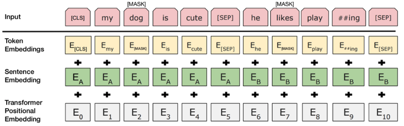

# Sentimental analysis of reviewers' feedback using BERT

**Note:** Retraining the BERT model took a long time to run at local computer, to run in the colab will be a good choice

## Objectives

To predict sentiment (postive, neutral, negeative) of customer feedback using tweet texts of differnt airline companies and compare different models'performace on text classification. 

Specifically, multiple machine learing models such as KNN, Random forest and SVC have been used for conduct classification as a baseline. A new language representation model named BERT (Bidirectional Encoder Representations from Transformers) was also implemented to conduct sentiment analysis. 

## BERT

Bidirectional Encoder Representations from Transformers (BERT) is a technique for NLP (Natural Language Processing) pre-training developed by Google and published in 2018.

BERT is a method of pretraining language representations that was used to create models that NLP practicioners can then download and use for free. You can either use these models to extract high quality language features from your text data, or you can fine-tune these models on a specific task (classification, entity recognition, question answering, etc.) with your own data to produce state of the art predictions.

### How BERT works?

BERT was built on the Transformer, an attention mechanism that learns contextual relations between words (or sub-words) in a text. The attention mechanism was used to extratct information of context of a given words and then encode it in a learned vector. Generally, there are two mechanisms - an encoder that reads the text input and a decoder that produces a prediction for the task.

The detailed workings of Transformer are described in a [paper by Google](https://arxiv.org/abs/1810.04805). Te figure below describe the brief steps of BERT during the traning process.

where the model takes a pair of sequences and pools the representation of the first token in the sequence. Note that the original BERT model was trained for a masked language model and next-sentence prediction tasks, which includes layers for language model decoding and classification. These layers will not be used for fine-tuning the sentence pair classification.

To help the model distinguish between the two sentences in training, the input is processed in the following way before entering the model:

    1 A [CLS] token is inserted at the beginning of the first sentence and a [SEP] token is inserted at the end of each sentence.
    2 A sentence embedding indicating Sentence A or Sentence B is added to each token. Sentence embeddings are similar in concept to token embeddings with a vocabulary of 2.
    3 A positional embedding is added to each token to indicate its position in the sequence. The concept and implementation of positional embedding are presented in the Transformer paper.

### Why BERT?

1 BERT offers an advantage over models like Word2Vec, because while each word has a fixed representation under Word2Vec regardless of the context within which the word appears, BERT produces word representations that are dynamically informed by the words around them.

2 As opposed to directional models, which read the text input sequentially (left-to-right or right-to-left), the Transformer encoder reads the entire sequence of words at once. Therefore it is considered bidirectional, though it would be more accurate to say that it’s non-directional. This characteristic allows the model to learn the context of a word based on all of its surroundings (left and right of the word).

## Data

You can go to [here](https://www.kaggle.com/crowdflower/twitter-airline-sentiment) to download the data used for the project. 

The [deep learning](https://www.kaggle.com/bertcarremans/deep-learning-for-sentiment-analysis) and machine learning to conduct multi-class classification of text can be found [here](https://www.kaggle.com/tankwin08/how-can-we-predict-the-sentiment-by-tweets/edit)

## Refereence

1 [BERT Word Embeddings Tutorial](http://mccormickml.com/2019/05/14/BERT-word-embeddings-tutorial/#history)

2 [BERT Explained: State of the art language model for NLP](https://towardsdatascience.com/bert-explained-state-of-the-art-language-model-for-nlp-f8b21a9b6270)